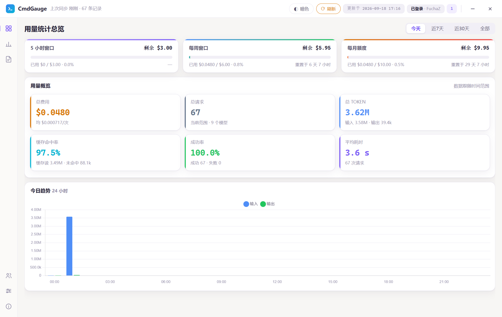
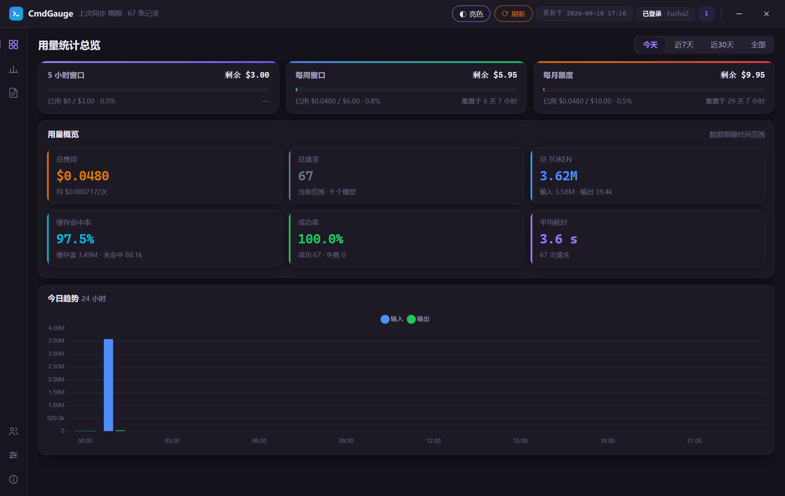
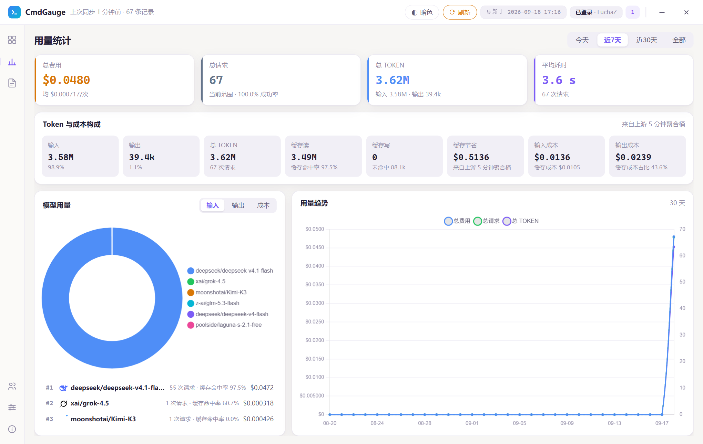
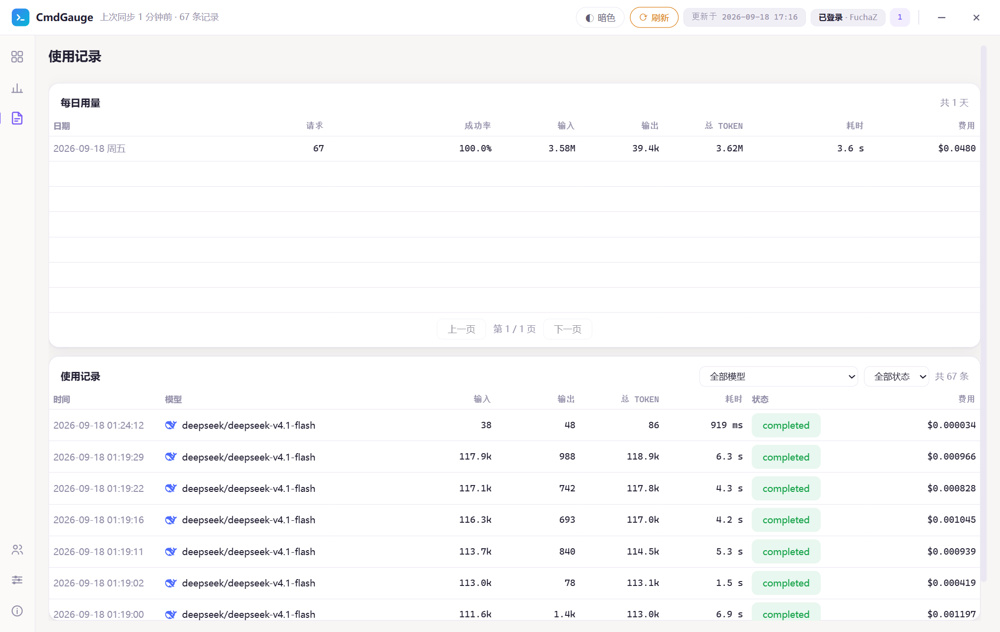
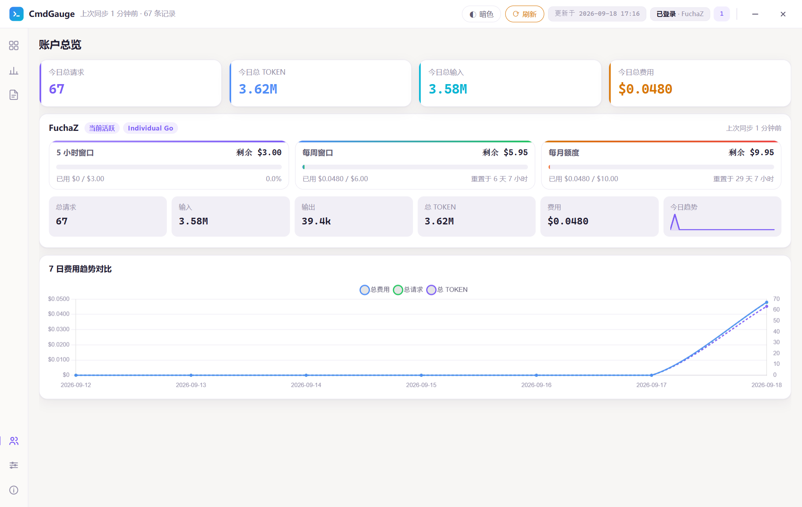
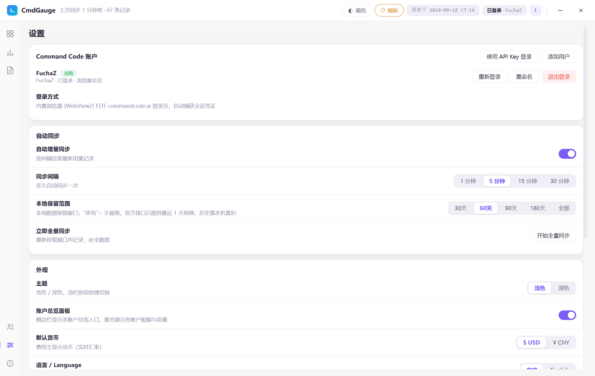
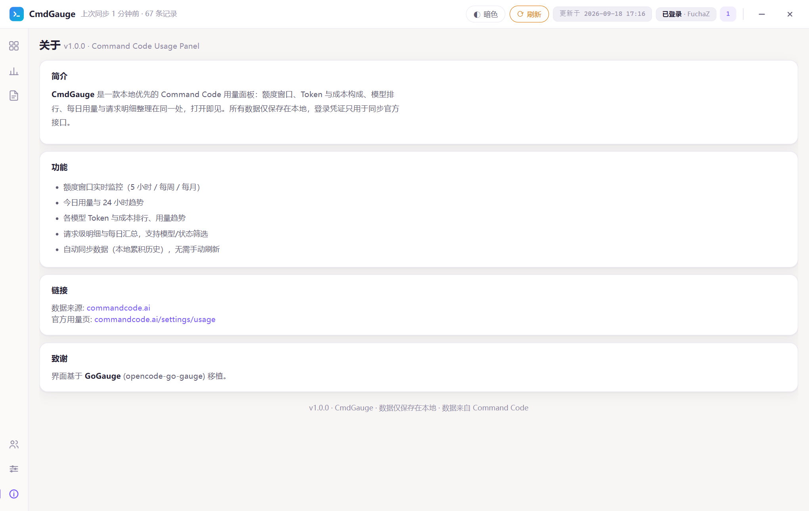

# CmdGauge — Command Code 用量仪表盘

<p align="center">
  
</p>

<p align="center">
  <b>本地优先的 Command Code 用量统计面板</b>：额度窗口、Token 与成本构成、模型排行、每日用量、请求明细，打开即见。
</p>

<p align="center">
  移植自 <a href="https://github.com/yphyphyph/opencode-go-gauge">GoGauge (opencode-go-gauge)</a>
</p>

---

## 📸 截图

| 主页（亮色） | 主页（暗色） |
|:---:|:---:|
|  |  |

| 用量统计 | 使用记录 |
|:---:|:---:|
|  |  |

| 账户总览 | 设置 |
|:---:|:---:|
|  |  |

| 关于 |
|:---:|
|  |

---

## ✨ 功能

- **额度窗口实时监控**：5 小时 / 每周 / 每月三个窗口，进度条 + 剩余额度（USD）+ 重置倒计时
- **用量概览**：总费用 / 请求数 / 总 TOKEN / **缓存命中率** / 成功率 / 平均耗时
- **今日趋势**：24 小时输入 / 输出柱状图
- **用量统计**：8 格 Token 与成本构成（输入/输出/总 TOKEN/**缓存读/缓存写/缓存节省**/输入成本/输出成本）、模型用量环形图 + 排行（带命中率）、费用/请求/Token 三线趋势
- **每日用量**：按天聚合请求数 / 成功率 / 输入 / 输出 / 总 TOKEN / 平均耗时 / 费用，分页浏览
- **使用记录**：请求级明细分页，支持模型 + 状态筛选，含耗时与单次费用
- **内置 WebView 登录**：独立登录窗口打开 commandcode.ai 官方登录页，自动捕获会话凭证，无需手动复制
- **API Key 登录（备选）**：不便用内置浏览器时可直接填 API Key；该通道受官方接口限制，只提供额度与汇总（UI 已明确标注）
- **自动同步（后端常驻）**：增量同步（1/5/15/30 分钟可选）+ 本地保留范围设置（30/60/90/180 天 / 所有）。定时由后端守护线程驱动，窗口收进托盘后照常运行，且每轮刷新**全部账号**的配额（不只是当前活跃账号）
- **多账号**：顶栏一键切换、重命名、删除，账户总览聚合各账号配额与用量；任意账号（含非活跃）都可单独重新登录
- **会话保活与有效期**：后台定期探测会话并自动滚动续期，账号行与总览卡片显示「登录剩余 N 天」，临期标黄、过期标红
- **双主题**：亮色 / 深色一键切换；中英双语界面
- **系统托盘**：点 × / Alt+F4 / 任务栏关闭都只是隐藏到托盘，窗口不会丢；要完全退出请用托盘图标右键菜单「退出」
- **窗口尺寸随手调**：无边框窗口的边缘 8px 可直接拖拽缩放（指针会变成双向箭头），标题栏有「最大化 / 还原」按钮、双击标题栏同样切换；窗口位置与大小会记住，下次启动沿用，矮窗口下首页布局自动压缩、不用滚动就能看全趋势图
- **本地优先**：所有数据保存在本机 SQLite，登录凭证仅用于同步官方接口

## 🖥 快速开始

### 直接使用（Windows）

下载 Releases 中的 `CmdGauge.exe`（单文件，无需安装）：

1. 双击运行，欢迎页点击「立即登录」弹出官方登录窗口
2. 在窗口内完成登录（GitHub 或邮箱），脚本自动捕获会话凭证
3. 自动进入面板并同步用量数据

> 需要 Windows 10/11（自带 WebView2 Runtime）。关闭窗口（含 Alt+F4 / 任务栏关闭）只会隐藏到系统托盘，**完全退出**请右键托盘图标选择「退出」。
> 数据保存在 exe 同目录 `data\` 文件夹。

### 源码运行

```bash
pip install -r requirements.txt
python entry.py
```

### 打包

```bat
build.bat
```

输出 `CmdGauge.exe`（**项目根目录**，与 `data` 同级；`--noconsole` 无黑窗，含 logo 图标与托盘支持）。

### 测试

```bash
pip install -r requirements-dev.txt
pytest tests -q                    # 数据层单测
python scripts/smoke_multiuser.py  # 多账号端到端冒烟 (不触网)
```

## 📊 数据说明

**数据来源**：`https://api.commandcode.ai`，两套端点族 —— `/internal/*`（网站自用，cookie 认证）
与 `/alpha/*`（官方 CLI 自用，`Authorization: Bearer <apiKey>`）。二者认证通道互斥。

| 用途 | 端点 | 认证 |
|---|---|---|
| 请求明细（游标分页） | `GET /internal/usage?limit=&cursor=&orgId=&targetUserId=` | cookie |
| 用量汇总 | `GET /internal/usage/summary` | cookie |
| **5 分钟聚合桶（缓存 token）** | `GET /internal/usage/charts?from=<ISO8601>&to=<ISO8601>` | cookie |
| 额度 / 窗口 | `GET /internal/billing/credits` | cookie |
| 订阅 | `GET /internal/billing/subscriptions` | cookie |
| 组织 | `GET /internal/orgs` | cookie |
| 模型目录 | `GET /internal/models` | cookie |
| 用户资料 | `GET /internal/profile/{login}` | cookie |
| **会话探测 / 保活** | `GET /auth/get-session`（better-auth，非 `/internal` 族） | cookie |
| 额度 / 订阅 / 汇总（API Key 模式） | `GET /alpha/billing/credits`、`/alpha/billing/subscriptions`、`/alpha/usage/summary`、`/alpha/whoami` | Bearer |

### 口径

- **总 TOKEN** = 输入（含缓存输入）+ 输出
- **缓存命中率** = 缓存读 token / 输入 token；**未命中** = 输入 − 缓存读
- **缓存节省** = 上游 `cacheSavings`（因缓存少花的钱）
- **缓存成本占比** = 缓存成本 /（输入成本 + 缓存成本）
- **成功率** = 1 − 失败请求数 / 总请求数（`status != completed` 记为失败）
- **费用**：USD 原始值；人民币按 open.er-api.com 实时汇率换算（6 小时缓存）

### 能力边界（全部实测）

| 限制 | 说明与本面板对策 |
|---|---|
| 明细窗口固定 `{days: 1, entries: 100}` | `days` / `since` / `window` / `range` / `period` 参数**全部被服务端忽略**，`limit` 上限 100（超出 400），且**不返回翻页游标**。→ 面板每 60 秒增量抓取 + 本地 SQLite 累积 |
| **明细不可翻页（每次最多 100 条）** | `/internal/usage` 的 `nextCursor` 恒为 `null`（实测传 `cursor='0'` 或 `limit=1000` 同样只回最新 100 条）⇒ 两次同步之间新增超过 100 条时，**中间部分永久丢失**（窗口只有 1 天，漏掉的再也取不回）。按实测约 25 条/小时，**进程停运行超过约 4 小时**就会开始漏。→ 唯一防线是保持托盘常驻（后台调度线程在窗口隐藏时也每 60 秒同步）；想核对完整周期用量请以上游账单周期汇总为准 |
| charts 缓存桶窗口极小 | `from`/`to` 必须是 ISO 8601（epoch 毫秒 → 400）；不传或只传一个 → 空数组；服务端只回窗口内**有数据**的最近约 7 个 5 分钟桶。→ 每次同步都拉（默认 5 分钟）以连续累积；关机期间的桶无法补回 |
| 明细项无 session / key / reasoning 维度 | 只有 token 数、三段成本与耗时。→ 「会话历史」改造为**「每日用量」** |
| `/alpha/*` 无请求级明细 | 官方 CLI 只做聚合。→ API Key 模式**明确降级**：仅额度与汇总，不产生明细与缓存指标 |
| 月度额度非 API 窗口字段 | API 无月度窗口对象，但直接给出 `monthlyCreditsGranted`，无需从套餐映射反推（套餐映射仅用于显示名称） |
| 会话是 7 天滑动窗口 | better-auth 的 `expiresIn=7d` / `updateAge=24h`：24 小时内有过一次会话请求，服务端就把有效期顺延 7 天，且**不轮换 token**（实测 `updatedAt` 恰好比 `createdAt` 晚 24h01m、`expiresAt` = `updatedAt` + 7d）。→ 面板由后台线程定期调 `GET /auth/get-session` 保活；若连续 7 天完全离线（一次请求都没有），仍需重新登录 |
| 会话端点不在默认 basePath | better-auth 默认挂在 `/api/auth/*`，但本站的 `basePath` 是 **`/auth`**：`/api/auth/get-session` 返回 404，`/auth/get-session` 才是真端点；未登录时返回 `200` + 字面量 `null`（而非 401） |

## 🔒 隐私

- 会话 cookie 仅保存在本机 SQLite，绝不写入日志、绝不上传
- 用量数据全部本地存储，应用不含任何遥测

## 🛠 技术栈

Python · pywebview (WebView2) · SQLite · Chart.js · pystray

## 🔗 与 GoGauge 的关系

CmdGauge 是 [GoGauge](https://github.com/yphyphyph/opencode-go-gauge)（OpenCode Go 用量面板）的移植版：
整体骨架（本地 HTTP 服务 + SQLite 存储 + WebView 登录 + 托盘 + 双主题双语前端）原样沿用，
数据层替换为 Command Code 的 `internal/*` 接口与数据模型。
数据库文件名、环境变量（`CMDGAUGE_DATA`）、图标与文案均已随项目更名。

## 📄 License

[MIT](LICENSE)
